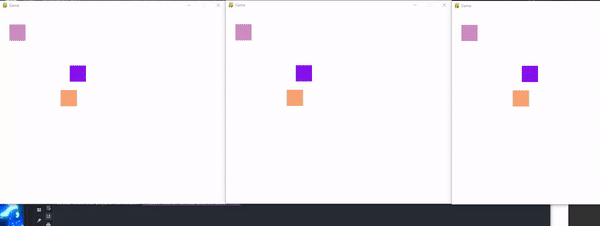

# MultiplayerGame
A simple multiplayer "Game" where multiple squares are able to join. A fun pet project to practice sockets and client to server communications.

## Footage

## Credits
Heavily inspired by Tech with Tim's Sockets tutorial. Added the ability to have more than one player on at a time, and a player being redrawn correctly when leaving.
